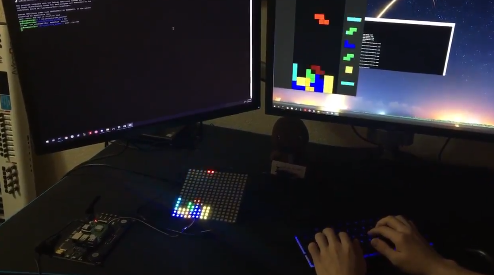

# tetris

I developed a Tetris game from scratch and streamed it to a Raspberry Pi. The Raspberry Pi received the data from a UDP socket and drove an LED grid to display the game.
This is the client for the tetris game. It contains the game engine code and redirects output to the graphics system for window display as well as network streaming.

